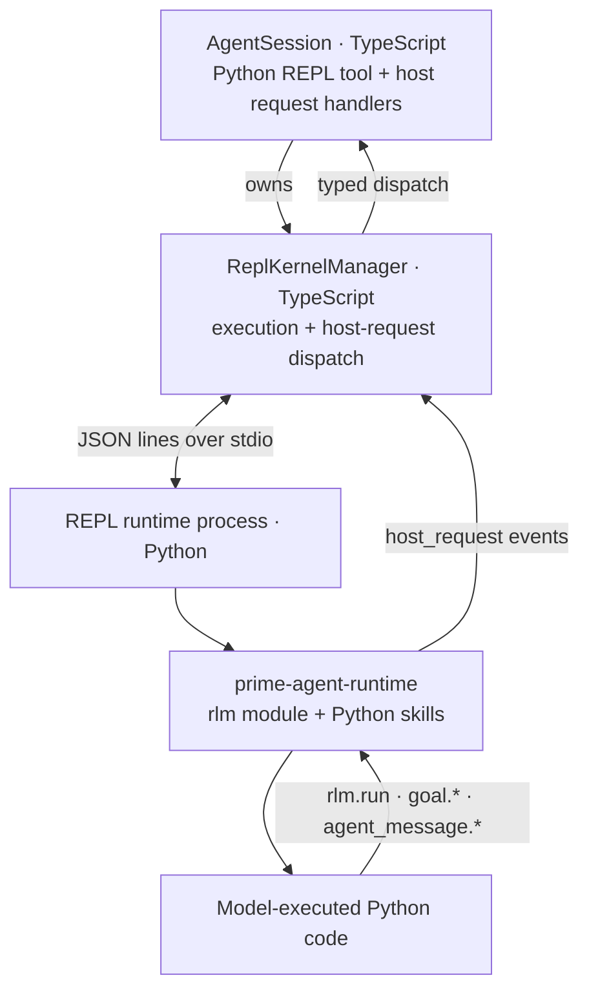
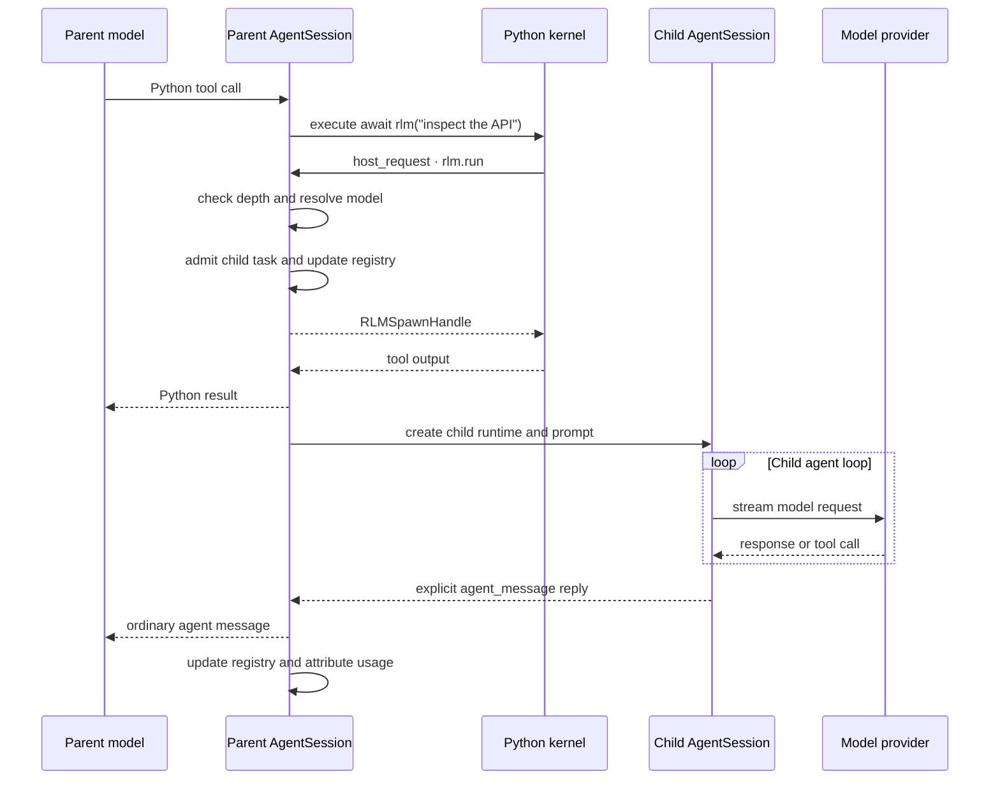

# RLM Runtime Architecture

Prime Agent gives each agent session a persistent Python REPL kernel and a native recursive sub-agent interface. The Python `rlm` package is a model-facing shim; the TypeScript host owns child execution, persistence, usage accounting, and lifecycle.

## Architecture



When the model delegates work:

```python
handle = await rlm("inspect the API", name="api-reviewer")
print(handle.rlm_child_id, handle.name, handle.session_dir, handle.model)
```

the call travels as a `host_request` event over the runtime's stdio protocol. `ReplKernelManager` dispatches request type `rlm.run` to the parent `AgentSession`, which starts a child through the same TypeScript agent machinery as the parent. The call returns over the same bridge immediately after task admission with a child handle; it never waits for or returns the child's answer. Results arrive through explicit `agent_message` replies, `rlm.collect` snapshots, or files.

The same bridge supports other typed host requests. Bundled Python skills such as `goal` call `rlm.host_request("goal.get", ...)`; state and policy remain in the TypeScript host.

## Delegation Flow



## Component Ownership

| Component | Responsibility |
|---|---|
| `src/core/kernel/repl-manager.ts` | Runtime process, stdio protocol, execution, host-request dispatch, interrupt, and shutdown. |
| `src/core/tools/ipython.ts` | Agent tool wrapper, lazy kernel provisioning, namespace bootstrap, and output shaping. |
| `src/core/agent-session.ts` | RLM policy, child creation, registry, usage attribution, cancellation, and goal handlers. |
| `src/core/rlm-runtime.ts` | Typed request/spawn-handle validation for `rlm.run`, model discovery, list, and delete. |
| `prime-agent-runtime/src/rlm/` | Python shim, handle types, callable `rlm`, and session-backed harness state. |

The Python side does not call providers or implement an agent loop.

## Kernel Lifecycle

The kernel is created lazily on first Python REPL use. Python resolution is:

1. `PRIME_AGENT_KERNEL_PYTHON`, when it has a current `prime-agent-runtime`;
2. the managed kernel venv under `~/.prime/agent/` (`kernel-venv-<hash>/bin/python`, one generation directory per build identity), bootstrapped with `uv`; or
3. the XDG data location when `~/.prime` is not writable.

The managed environment includes Python 3.11, `prime-agent-runtime`, `dill`, and the default Python packages. A bootstrap marker detects stale environments.

Startup spawns `python -P -m rlm.repl` in the session working directory and exchanges newline-delimited JSON over stdio. The `-P` (safe path) flag keeps that directory off `sys.path`, so a checkout cannot shadow `rlm`, `dill`, or stdlib modules; project code is not importable from the kernel and runs through the project's own environment instead. The same flag is passed to the bootstrap's `python -c "import ..."` probes. The runtime announces itself with a single `ready` event, then requests and events flow one JSON object per line (see `prime-agent-runtime/src/rlm/repl.md`).

The manager owns the child process and a bounded stderr tail. Shutdown sends a `shutdown` request, waits for the process to exit, and terminates it as a fallback. Persistent sessions may snapshot the kernel namespace into their session artifact directory for revival.

## Stdio Transport

Requests flow to the runtime on stdin and events return on stdout, one JSON object per line:

```text
requests  execute, interrupt, host_reply, snapshot, restore, list_names, shutdown
events    ready, stdout, stderr, result, display, host_request, error, done
```

Output events carry the id of the cell that was running when the bytes were produced; asyncio tasks keep their spawning cell's id even after that cell finishes, so detached work is attributed correctly.

Calls to `ReplKernelManager.execute()` are serialized. One kernel has one shared namespace and does not run two ordinary Python cells concurrently. RLM child agents can still run concurrently because each delegation uses a distinct host request and child runtime.

## Host-Request Event Flow

A running cell can await task admission:

```python
handle = await rlm("subtask")
```

The runtime ships the call to the host as a `host_request` event and keeps its event loop free while awaiting the reply. The host dispatches the typed request and answers with a `host_reply` request carrying the same id, so a cell can block on admission without stalling other runtime work. Child answers do not use this response path; they arrive later through explicit `agent_message` replies or files. The one read that does use it is `rlm.collect`, which returns compact per-child snapshots over the same request/reply pair instead of answers.

## Python API

`prime-agent-runtime` exports:

```python
rlm
run(prompt: str, **kwargs)
find_models(query: str = "", limit: int = 8)
list_subagents()
collect(targets=None, *, timeout_ms=0)
delete_subagent(target: RLMSpawnHandle | RLMSubagent | str)
host_request(request_type: str, payload: dict | None = None)
RLMSpawnHandle
RLMModel
RLMSubagent
RLMChildResult
RLMChildStallAbort
```

The kernel bootstrap places the callable `rlm` object in the user namespace, so these are equivalent:

```python
await rlm("subtask")
await rlm.run("subtask")
```

`RLMSpawnHandle` contains `rlm_child_id`, `name`, `session_dir`, and `model`. It confirms admission only and never contains the child's answer.

Supported `rlm.run` options are:

- `name`: a unique readable child session name;
- `model`: an exact `provider/model` selector from `rlm.find_models()`; and
- `thinking`: an explicit child reasoning level; must be valid for the resolved child model, defaults to the parent level (clamped to the child model).

Unknown options fail instead of being ignored. Model search is bounded to active, non-expired credentials. If an exact selection is unavailable or fails auth preflight, spawn fails instead of silently falling back to another model. A child otherwise inherits the parent model.

## Child Execution

`AgentSession.runRlmChild()` performs the following sequence:

1. Check `RLM_DEPTH < RLM_MAX_DEPTH`.
2. Resolve the requested model or inherit the parent model.
3. Create a `sub-xxxxxxxx` child directory under the parent artifact directory.
4. Admit the task into the parent registry and return its `RLMSpawnHandle`.
5. In detached work, create a child `SessionManager`, `Agent`, and `AgentSession`.
6. Reuse provider hooks, resource loader, model registry, tools, transport, retry settings, and thinking configuration.
7. Run the child prompt, retain its session, and update lifecycle state independently of the admission call.
8. Attribute child usage to the parent assistant turn and persist the attribution.

Children receive incremented `RLM_DEPTH`, the inherited maximum depth, and their own `RLM_SESSION_DIR`. The default maximum depth is 2, so root sessions may create children and grandchildren; grandchildren may not create another generation unless the limit is configured higher.

## Independent Delegation

Each direct call admits an independent child and returns its handle immediately:

```python
api_review = await rlm("review the API", name="api-reviewer")
test_review = await rlm("review the tests", name="test-reviewer")
audit = await rlm("slow independent audit", name="audit-reviewer")
```

End the turn instead of waiting for completion. Children send requested answers with `await agent_message.send(message, receiver_role="parent")`, and replies arrive as ordinary agent messages over later turns. A child may instead write results to files for the parent to read. The host runs each admitted child as an independent `AgentSession`; daemon-backed children can be retained as independently addressable session workers.

## Parent-Scoped Sub-Agent Registry

The TypeScript parent maintains the authoritative direct-child registry. `await rlm.list_subagents()` returns stable child IDs, active-session IDs when daemon-backed, session IDs, names, directories, and running/completed status.

This registry survives kernel restart, compaction, and parent restore. Successfully completed daemon-backed children are rehydrated from the parent artifact registry. Inline children remain inspectable in the current process but have no active-session ID.

The parent can continue a retained daemon child with `await agent_message.send(..., receiver_role="child", receiver_name=child.session_name)`. `rlm.delete_subagent()` accepts the spawn handle returned by `rlm.spawn`, a subagent row from `list_subagents()`, or an exact child ID, active-session ID, session ID, or unique name. Deletion cancels or closes the runtime, writes a durable tombstone, and removes the child from messaging and observation. It does not erase the transcript or artifacts on disk.

Registry scope follows the parent transcript. An unrelated new parent session does not inherit children.

## Typed Fan-In (`rlm.collect`)

`await rlm.collect(targets=None, timeout_ms=0)` is the read-side companion of the registry: one call returns a typed envelope per direct child instead of N steering messages, N file reads, or a roster poll that says nothing but "done".

```python
results = await rlm.collect(timeout_ms=30_000)
for entry in results:
    print(entry.session_name, entry.status, entry.settled, entry.terminal_kind)
    if entry.settled and entry.terminal_kind != "none":
        print("  outcome:", entry.terminal_reason)
    if entry.stall_abort:
        print("  watchdog:", entry.stall_abort.silent_ms, entry.stall_abort.in_flight_tools)
```

`targets` accepts child ids, child session names, child session ids, spawn handles, registry rows, or a list mixing them; `None` or `[]` selects every direct child that is not being deleted. An unknown selector raises, and an ambiguous one raises instead of guessing.

Each `RLMChildResult` carries `rlm_child_id`, `session_name`, `session_dir`, `status`, `settled`, `answer_preview`, `error`, `duration_ms`, `tool_use_count`, `replied_since_task`, `activity_kind`, `terminal_kind`, `terminal_reason`, and `stall_abort`. `activity_kind` is the child's live activity (`waiting`, `writing`, `executing`, `stalled`) and is the only "still working" signal for a child retained without a run - the daemon-recovery shape, whose `status` stays `done` for the recorded task.

The wait is bounded and never destructive:

- `timeout_ms=0` is a guaranteed non-blocking read; a positive value blocks only that kernel call.
- A timeout returns the current snapshots. It does not raise, does not steer the parent, and does not cancel, abort, or delete any child.
- The host caps one wait just inside its read-only host-request budget (the `agentMessage.targetWaitSeconds` short tier, 60s by default) so a collect can never lose a race with the kernel's own bound and turn into a timeout error. The effective value is returned in the host reply payload as `timeout_ms`, and a shortened wait is logged as `rlm collect wait clamped`.
- Aborting the cell (Esc) ends the wait the same way: snapshots, not an error.
- A settled child keeps its envelope until it is deleted, so re-collecting after a compaction or a kernel restart costs nothing.

`status` is the raw run status and reads `done` for a child the stall watchdog killed. `terminal_kind` is the classification the child's own terminal path recorded - `stall_killed`, `aborted`, `error`, `cancelled`, `completed_without_reply`, or `none` when the parent already knows - and `stall_abort` carries the watchdog facts (`silent_ms`, `threshold_ms`, `in_flight_tools`, `kernel_reasons`, `settled`). Read those two before trusting a completion. `terminal_kind` is absent while a run is in flight, and for a child whose notice path never ran (a suppressed or explicitly deleted child, or one rehydrated without a run).

`collect` is a read: it is on the cancellable kernel host-request whitelist, so a cell abort cancels the wait and nothing else. Large child outputs still belong in files; the envelope's `answer_preview` is a compact preview, not the child's full result.

## Usage and Cost Attribution

The admission handle does not contain usage or completion data. Prime Agent asynchronously folds the child's assistant usage and cost into the parent assistant turn that launched it.

The parent transcript persists a `child_usage_attributed` entry containing:

- the target parent assistant message ID;
- the child usage being attributed; and
- the resulting aggregate usage.

On reload, the aggregate is reapplied to the parent message. Context-tree reporting subtracts attributed child usage when showing each node's own usage, so tree-wide own usage and root aggregate totals remain reconcilable. Child work increases billable session totals but does not inflate the parent model's context-window measurement.

## Continual Harness State

`rlm.harness` is a persisted state ledger for prompt notes, memories, reusable skill descriptions, sub-agent specifications, and refinement events. It is not a second execution engine.

Session-local state lives in the session artifact directory under `harness/harness_state.json`. Explicitly global entries live under `~/.prime/agent/harness/`. The Python store reloads after external modification so host-side `/refine` writes and kernel writes do not overwrite each other.

`/refine` runs a dedicated review over the current trajectory and applies small create/update/delete edits. Rollback uses recorded before/after snapshots. The base system prompt remains immutable; refinements are supplemental state.

## Goal Requests

The bundled `goal` Python skill is a thin host-bridge client:

```python
await goal.get()
await goal.create("ship the release", token_budget=200000)
await goal.complete()
```

Goal state, persistence, token and wall-clock accounting, and continuation prompting live in `AgentSession`. When goals are disabled, the skill and `goal.*` host handlers are not registered.

## Session Artifacts

For a persisted root session, the relevant layout is:

```text
~/.prime/agent/
  sessions/
    <root-session-id>.jsonl
  session-artifacts/
    <root-session-id>/
      kernel-state.dill
      kernel-state.json
      scheduled-jobs.json
      harness/
        harness_state.json
      sub-xxxxxxxx/
        <child-session-id>.jsonl
        sub-yyyyyyyy/
```

Exact artifact files are created only when their features are used. Non-persistent sessions place RLM directories under the OS temporary directory and do not gain revivable session artifacts.

## Trust Boundary

The REPL runtime process executes model-generated Python and `bash()` commands with the worker's OS permissions. The process boundary isolates protocol and lifecycle concerns; it is not a security sandbox. Installed Python packages, skills, and extensions are trusted code. Use an external sandbox or restricted execution environment when the workspace or generated code is untrusted.

Provider credentials are resolved by the TypeScript host. The bounded model catalog crosses into Python as metadata; the full auth store does not.

## Failure Modes

| Failure | Behavior |
|---|---|
| Managed runtime is missing | Kernel bootstrap rebuilds it; a custom `PRIME_AGENT_KERNEL_PYTHON` without a current `prime-agent-runtime` is rejected at kernel startup. |
| Depth limit reached | The host rejects the `rlm.run` request; the error reply raises in Python. |
| Unsupported options | Host rejects the request. |
| Requested model unavailable | Spawn fails instead of substituting another model. |
| Host connection closed | Pending `host_request` calls fail with `RuntimeError` so awaiting cells unblock. |
| Child cancellation | Host aborts the child and removes failed/cancelled registry entries. |
| Parent teardown | Active descendants are cancelled and their runtimes are closed. |

## Focused Validation

From the repository root, the implementation is covered by focused kernel, recursion, context-tree, daemon RLM, and runtime tests. When changing child creation or accounting, include `agent-session-recursion.test.ts`; when changing the stdio runtime protocol, include the `repl-kernel-*.test.ts` suites; when changing daemon retention, include the daemon RLM lifecycle tests.
